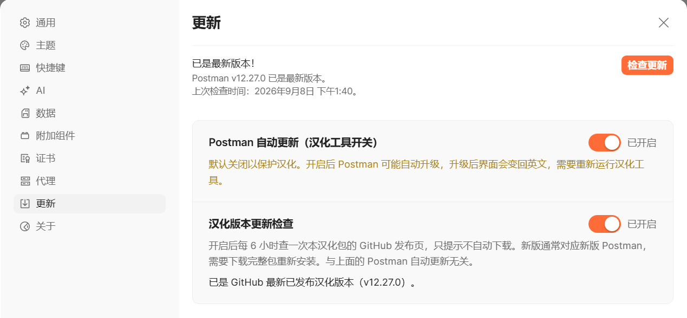

# Postman 中文版

[下载汉化包](https://github.com/Aerozb/Postman-cn/releases) · [下载汉化脚本](https://github.com/Aerozb/Postman-cn/archive/refs/heads/main.zip)

## Windows

三种方式任选一种：

### ① 汉化脚本

1. 安装官方 [Postman](https://www.postman.com/downloads/) 和 [Node.js 22+](https://nodejs.org/)。
2. 下载上方的汉化脚本，解压后双击 `postman-zh.bat`。
3. 输入 **1（安装汉化）**，或直接回车，等待“验证通过”即可。

脚本会自动备份英文原版，安装成功后清理旧版本。Postman 升级后，再执行一次 **1**。

### ② 替换 app.asar

1. 完全退出 Postman，下载与本机 Postman **版本一致**的 `app.asar`。
2. 找到安装目录里的 `app-<版本>\resources\app.asar`，先备份原文件，再用下载的文件替换。
3. 重新打开 Postman。

### ③ 绿色版

下载 `Postman-cn-<版本>-win64.zip`，完整解压后运行其中的 `Postman.exe`，直接使用中文版。

## macOS 与其他系统

**仅手动替换 app.asar**；汉化脚本和绿色版仅用于 Windows。

1. 完全退出 Postman，下载与本机 Postman **版本一致**的 `app.asar`。
2. 在“应用程序”中右键 `Postman.app` → **显示包内容** → `Contents/Resources`。
3. 备份原来的 `app.asar`，替换为下载的文件，再启动 Postman。

Linux 等其他系统同样只手动替换安装目录中的 `resources/app.asar`。

> 当前发布产物在 Windows 上验证；macOS／Linux 请自行确认兼容性，启动异常时恢复备份。

## 两个更新开关

位置：Postman 右上角 **齿轮 → 设置 → 更新**。

| 开关 | 默认 | 作用 |
|---|---|---|
| **Postman 自动更新（汉化工具开关）** | 关闭 | 控制官方升级。开启后升级可能覆盖汉化，届时需重新汉化。 |
| **汉化版本更新检查** | 开启 | 每 6 小时检查 GitHub 汉化发布版本；只提示，不自动下载或安装。关闭后停止检查。 |

两者互相独立；灰色表示关闭，橙色表示开启。

