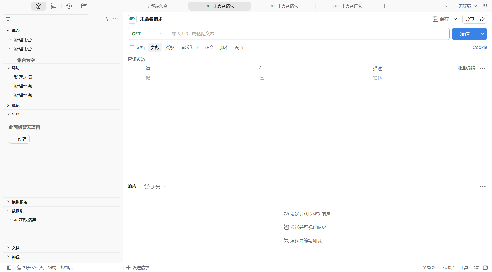
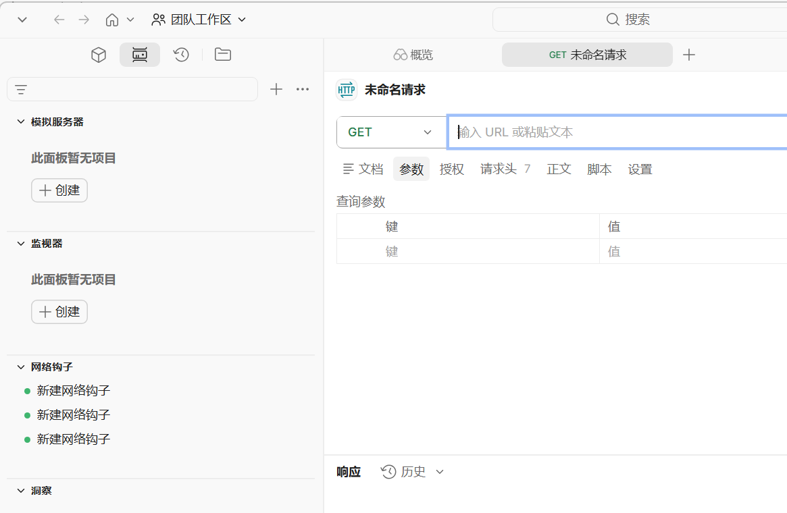

# Postman 中文版

Postman 桌面版汉化补丁，适用于 Windows 10/11 与 Postman 12.x。

> 本项目为非官方汉化，仅供学习交流。Postman 及相关商标归 Postman 公司所有。

<p align="center">
  
  
</p>

## 直接使用发布版

前往 [Releases 下载页](https://github.com/Aerozb/Postman-cn/releases)，按 Postman 版本选择：

- `Postman-cn-<版本>-win64.zip`：解压后直接运行，适合大多数人。
- `app.asar`：只替换同版本官方安装目录中的 `resources\app.asar`，**替换前请先备份原文件**（否则之后无法还原英文）。

两者都是免安装的成品包，**不含本工具链和英文原版备份**，所以既不能一键还原英文、也不能用 `install` 更新汉化。想要这两项能力，就装官方版 Postman，再用下面的统一入口。

## 使用统一入口

仓库根目录只有一个用户入口：[postman-zh.bat](./postman-zh.bat)。安装 Node.js 22+ 后直接双击它即可使用中文菜单，普通用户不需要打开 PowerShell，也不要直接运行 `scripts` 里的实现文件。

| 序号 | 操作 | 说明 |
|---:|---|---|
| `1` | 安装汉化 | 打补丁、关闭自动更新并验证；直接回车也执行此项。 |
| `2` | 验证汉化状态 | 只检查当前安装，不改动文件。 |
| `3` | 还原英文原版 | 用首次安装时自动备份的 `app.asar.original` 恢复官方英文界面。 |
| `4` | 启动 Postman | 启动并等待当前 CDP 调试端口就绪。 |
| `5` | 关闭 Postman | 彻底关闭全部 Postman 进程。 |
| `6` | 导出运行时漏翻 | 导出用户实际遇到的疑似漏翻文案。 |
| `7` | 静态扫描界面文案 | 扫描未翻译候选，供维护者补词条。 |
| `8` | 合并译文 | 把 `_generated/trans-*.json` 合并进词典。 |
| `9` | 深度审计界面 | 进入中文审计子菜单。 |
| `10` | 自动更新开关 | 默认关闭；开启后官方升级会覆盖汉化。 |
| `11` | 修复浏览器链接 | 仅在登录页外部链接异常时使用。 |
| `12` | 发布（维护者） | 推送代码并创建 Release。 || `h` | 查看完整命令帮助 | 查看维护命令和参数。 |
| `0` | 退出 | 不执行操作；`q` 也可退出。 |

选择一项任务后只执行该任务，结束时会显示中文结果并自动关闭双击打开的窗口，不需要再按确认键。默认不打印大段 Postman/Electron/npm 日志或诊断 JSON；维护者只有显式传入 `--details` 才会看到脱敏后的详细诊断。

“深度审计界面”子菜单包含：轻量界面巡检、新建请求界面、新建集合界面、导入界面、导航与设置界面、深层界面、容易漏翻的重点界面、入口弹窗、分阶段完整审计、固定区域审计和全部调试目标。子菜单输入 `0` 返回主菜单，输入 `q` 直接退出。

## 想不想自动更新，自己说了算

安装汉化后默认会**拦截 Postman 自动更新**——因为官方升级会新建一个版本目录，汉化补丁不会跟过去，升级完界面就全变回英文了。

需要升级时可以自己打开开关，两个地方改哪个都行，它们是同一份状态：

- Postman 里点 **设置 > 更新**，最上面那一栏就是「Postman 自动更新（汉化工具开关）」，点一下即可切换
- 或者双击 `postman-zh.bat`，选主菜单第 `10` 项

页面上是一个滑动开关，点一下即切换：向右变橙色是「已开启」，向左变灰是「已关闭」。命令行 `postman-zh.bat updates on|off` 改的是同一份状态。

**开启后请注意**：Postman 升级完成后界面会变回英文，届时重新双击 `postman-zh.bat` 装一次汉化即可。不想被打扰就保持默认关闭。

## 汉化有新版会主动告诉你

「设置 > 更新」页里还有第二个开关——**汉化版本更新检查**，默认**开启**。它每 6 小时问一次本项目的 GitHub 发布页，有新版就在右下角浮个小提示。

两个开关别混：上面那个管 **Postman 官方升级**（默认关，因为升级会覆盖汉化），这个只管**汉化包本身有没有新版**（默认开）。

有新版时可以直接在应用内下载：点提示条或设置页的「下载新版」，后台拉取 `app.asar` 并校验体积、SHA-256、以及包内 Postman 版本是否与你的一致。**下载完不会自动安装**——替换 `app.asar` 必须先关掉 Postman，自动重启会打断你正在编辑的请求。所以下载完只提示「已就绪」，点「打开下载位置」拿到文件，再运行一次汉化工具的安装即可。

- 提示条上「不再提示此版本」= 这一版不再打扰，之后有更新的版本还会提示
- 不想要这个功能：把开关关掉，之后一个网络请求都不会发
- 命令行等价操作：`postman-zh.bat zh-updates on|off`，`zh-updates check` 可以忽略节流立刻查一次

下面的命令行方式只供维护者、自动化测试或故障排查使用，普通用户不需要手敲命令：

```powershell
.\postman-zh.bat install       # 安装汉化、关闭自动更新并验证
.\postman-zh.bat restore       # 还原英文原版
.\postman-zh.bat updates on    # 允许 Postman 自动更新（默认是 off）
.\postman-zh.bat zh-updates    # 查看汉化版本检查开关（默认 on）；加 check 立即查一次
.\postman-zh.bat help          # 查看所有命令
```

常用维护命令：

```powershell
.\postman-zh.bat collect       # 导出运行时漏翻
.\postman-zh.bat collect -Clear
.\postman-zh.bat verify        # 单独验证；加 --details 查看完整诊断
.\postman-zh.bat start         # 启动并等待 CDP 调试端口
.\postman-zh.bat stop
.\postman-zh.bat static-scan --disk  # 扫描磁盘缓存中的 UI 文案；不加 --disk 则扫描运行中的页面
.\postman-zh.bat merge --check # 只检查待合并译文
.\postman-zh.bat merge         # 合并 _generated/trans-*.json
.\postman-zh.bat probe         # 检查更新页面，仅维护者命令行使用
.\postman-zh.bat scan          # 扫描可点击界面
.\postman-zh.bat audit new-request
.\postman-zh.bat publish -CheckOnly
```

上面除 `stop`、`merge` 和 `static-scan --disk` 外都要连 CDP，**Postman 必须在运行**，否则会报「没有找到 Postman 页面目标」；先跑 `start`。`install` 自己会重启 Postman，它内置的那次验证不受影响。

`probe` 和通用 `scan` 没有放进普通用户菜单，只作为维护者命令行能力保留。完整参数以 `.\postman-zh.bat help` 为准。

TUI 中的高级审计默认使用受控档。发布前确需扩大覆盖时，维护者可在命令行加 `--thorough`；哪些审计名支持它、预算参数和默认时限见 [scripts/README.md](./scripts/README.md)。达到预算后保存的是部分报告，命令返回退出码 `2`，不能当成完整覆盖。

自动审计会跳过“文件、文件夹、上传、浏览、选择文件”等会打开 Windows 文件选择器的入口。`audit import` 只从 Postman 页面内打开导入弹窗并检查无需选择本机文件的页签，结束后会自动关闭临时弹窗；通用审计不会重复点击导入入口。

安装到指定版本目录：

```powershell
.\postman-zh.bat install -PostmanDir C:\Path\To\Postman\app-12.26.3
```

脚本会自动备份 `resources\app.asar` 为 `app.asar.original`，从备份解包、注入汉化、重新打包并启动验证。Postman 更新后再次运行 `install` 即可。

`install` 只修改目标 Postman 版本目录，不会改动系统 HTTP/HTTPS 处理程序。仅在登录页外部链接确有异常时，才单独运行 `fix-browser`。

## 常见问题

- `GET`、`POST`、`API`、`JSON`、快捷键和产品名等技术词会刻意保留英文。
- 安装后仍是英文，通常是 Postman 更新到了新的 `app-*` 目录；重新运行 `install`。
- 登录页外部链接异常时运行 `.\postman-zh.bat fix-browser`。

完整使用说明见 [docs/汉化教程.md](./docs/汉化教程.md)，维护细节见 [AGENTS.md](./AGENTS.md) 和 [docs/维护指南.md](./docs/维护指南.md)。

审计过程产生的 JSON 报告会写入项目同级 `_generated`，并由统一安全模块裁剪账号参数、令牌、请求正文和本机路径。截图默认关闭，只有一部分命令支持显式传入 `--screenshot`（名单见 [scripts/README.md](./scripts/README.md)）；PNG 像素不会经过 JSON 脱敏，可能包含当前可见的工作区或请求内容。这些临时产物都不会进入仓库。
